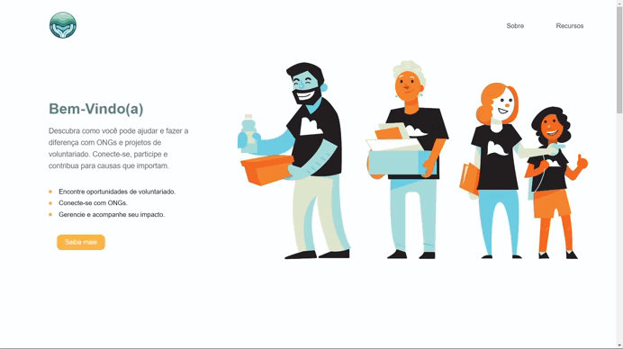
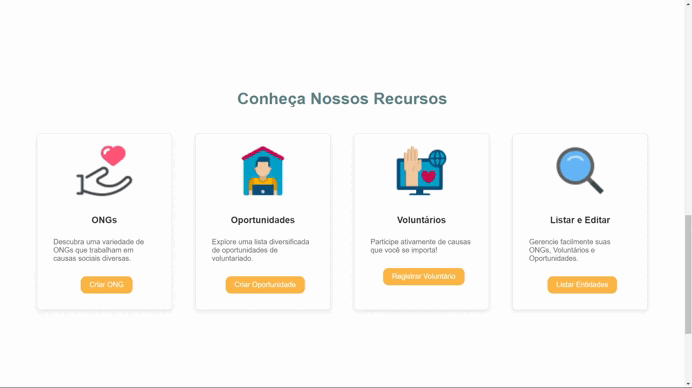
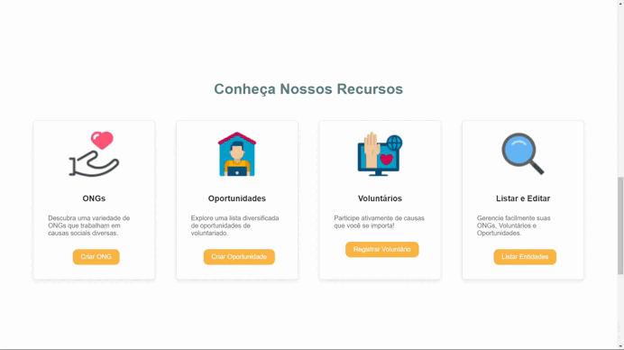

# NGOs, Volunteers, and Opportunities Management

This project is the frontend interface for a system that manages NGOs, volunteers, and opportunities. It allows NGOs to register opportunities, volunteers to apply and manage their interests, and enables all entities to be viewed and manipulated in an intuitive way.

## Table of Contents

- [Requirements](#requirements)
- [Installation](#installation)
- [Usage](#usage)
- [API](#api)
- [Presentation](#presentation)
- [Contributions](#contributions)

## Requirements

To run the frontend of this project correctly, you need to have the backend API running, as many of the functionalities depend on communication with the database via API. The API manages NGOs, opportunities, and volunteers, allowing the creation, editing, and removal of these entities.

**Prerequisites**:
- Node.js (v14 or higher)
- Running backend API (check the API repository [here](https://github.com/VictorCDS-p/ong-api))
  
## Installation

1. Clone this repository to your local machine:
   ```bash
   git clone https://github.com/VictorCDS-p/ong-frontend
   ```

2. Navigate to the project directory:
   ```bash
   cd ong-frontend
   ```

3. Install dependencies:
   ```bash
   npm install
   ```

4. Ensure that the API URL is correctly configured in the `services` folder of the frontend. Example configuration:
   ```
   API_URL = "http://localhost:3000"
   ```

5. Start the project:
   ```bash
   npm run dev
   ```

6. The frontend will be running at `http://localhost:5173/`, or at the port configured in your environment.

## Usage

After installation and execution, the frontend offers the following functionalities:

- Listing of NGOs, opportunities, and volunteers.
- Creation and editing of NGOs, opportunities, and volunteers.
- Detailed view of each entity.
- Deletion of entities with confirmation prompt.

### Main Features

- **NGOs**: Register NGOs with details about the organization.
- **Opportunities**: NGOs can register and list volunteer opportunities.
- **Volunteers**: Volunteers can apply and manage their interests in available opportunities.

## API

This project connects to the API to perform CRUD (create, read, update, delete) operations on NGOs, opportunities, and volunteers. The main routes consumed by the frontend are:

- `/ongs` - For listing, creating, and deleting NGOs.
- `/opportunities` - To manage volunteer opportunities.
- `/volunteers` - To register and list volunteers.

### API Documentation

For more details on how to set up and use the API, check the documentation [here](https://github.com/VictorCDS-p/ong-api).

## Presentation

Here are some example images of the project in action:

### Home Page


### Tools


### NGO Listing

